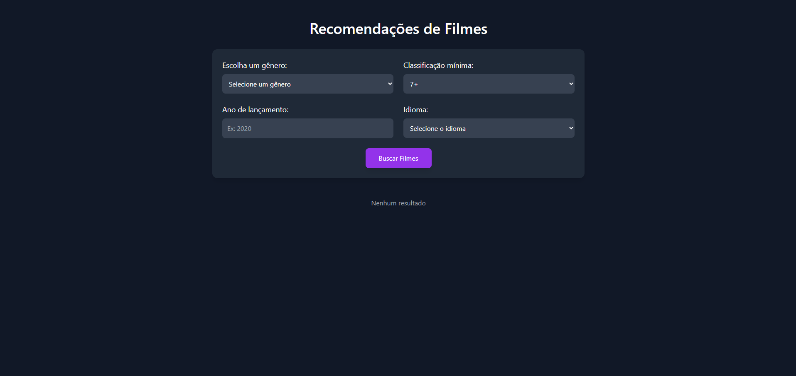
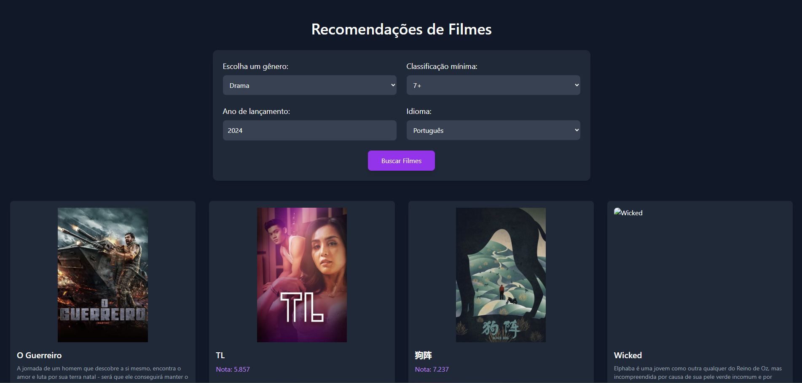

# 🎬 Recomendador de Filmes (React + TMDB + Tailwind)


Aplicação web que recomenda filmes a partir de filtros (gênero, nota mínima, ano e idioma), consumindo a [TMDB API](https://developer.themoviedb.org/). UI responsiva com **Tailwind CSS**.

> **Atenção**: não exponha a chave da API no código-fonte. Siga a seção **Configuração (.env)**.

---

## ☰ Sumário
- [Visão Geral](#-visão-geral)
- [Demonstração](#-demonstração)
- [Funcionalidades](#-funcionalidades)
- [Arquitetura & Estrutura](#-arquitetura--estrutura)
- [Como Funciona (TMDB)](#-como-funciona-tmdb)
  - [Mapeamento dos filtros → parâmetros](#mapeamento-dos-filtros--parâmetros)
- [FAQ](#-faq)
- [Licença](#-licença)
- [Autor](#-autor)

---

## 🔎 Visão Geral

O projeto oferece uma interface simples para explorar filmes populares de acordo com preferências do usuário. Os dados vêm do endpoint **`/discover/movie`** da TMDB, e os pôsteres são carregados via CDN oficial de imagens.

---

## 🎥 Demonstração



- **Deploy**: [recomenda-ai](https://recomenda-ai-project.vercel.app/)

---

## ✅ Funcionalidades

- Filtro por **gênero** (Ação, Comédia, Drama, Romance, Animação, Documentário)
- Filtro por **nota mínima**
- Filtro por **ano de lançamento**
- Filtro por **idioma** (resposta localizada) e/ou **idioma original**
- Ordenação por **popularidade**
- **Fallback** de imagem quando o pôster não existe
- UI **responsiva** com Tailwind

---

## 🧱 Arquitetura & Estrutura

```
.
├── public/
├── src/
│   ├── components/
│   │   └── Home.jsx        
│   ├── main.jsx            
│   ├── index.css           
│   └── assets/
├── package.json
├── tailwind.config.js
├── postcss.config.js
└── README.md
```

- **Home.jsx**: contém os estados de filtro, chamada HTTP e renderização dos cards de filmes.
- **index.css**: inclui as diretivas do Tailwind.

---

## 🚀 Ferramentas

- **Node.js** ≥ 18
- **TawilindCss**
- Conta na **TMDB** e uma **API Key v3** (ou **v4 token**)


## 🧩 Como Funciona (TMDB)

A tela usa **axios** para chamar o endpoint:

```
GET https://api.themoviedb.org/3/discover/movie
```

### Mapeamento dos filtros → parâmetros

| Filtro UI           | Parâmetro (TMDB)            | Observações                                                                 |
|---------------------|------------------------------|------------------------------------------------------------------------------|
| Gênero              | `with_genres`               | IDs conforme TMDB (ex.: 28 Ação, 35 Comédia, 18 Drama...)                   |
| Nota mínima         | `vote_average.gte`          | **Importante:** utilize `vote_average.gte` (e não `vote_average=gte:7`).    |
| Ano de lançamento   | `primary_release_year`      | Alternativa: `primary_release_date.gte/lte` para intervalos.                |
| Idioma (resposta)   | `language`                  | Ex.: `pt-BR` para traduzir títulos/descrições retornados.                   |
| Idioma original     | `with_original_language`    | Ex.: `en`, `pt`, `es` (ISO 639‑1, 2 letras).                                |
| Ordenação           | `sort_by`                   | Ex.: `popularity.desc`, `vote_average.desc` (c/ `vote_count.gte` recomendado). |
| Adulto              | `include_adult`             | Recomenda-se `false`.                                                       |
| Paginação           | `page`                      | 1..N                                                                         |

---

## ❓ FAQ

**Posso esconder totalmente a chave TMDB no front‑end?**  
Chaves TMDB v3 normalmente ficam expostas em apps client-side. Para proteção adicional, crie um **proxy/serverless** (Vercel/Netlify) que injete a chave no **backend** e o front chame apenas seu endpoint.

**Como obter mais campos (elenco, trailers)?**  
Use o endpoint `movie/{movie_id}` e/ou `append_to_response=credits,videos,images` após obter o `id` no `discover`.

**Como mudar o tamanho da imagem?**  
Altere `w500` para `w342`, `w780` etc. conforme a **Image API** da TMDB.

---

## 📄 Licença

Distribuído sob a **Licença MIT**. Veja `LICENSE`.

---

## 👤 Autor

- **Pedro Sawczuk** — [@PedroSawczuk](https://github.com/PedroSawczuk)

Se usar este projeto, considere deixar uma ⭐ no repositório!
